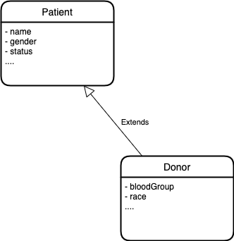

# FHIR Understanding via Blood Bank App
FHIR is a standard for health care data exchange, published by HL7®.
FHIR defines resources for clinical and administrative content (e.g. Observation, Patient, etc.) as well as resources for “infrastructure” purposes. Some of these infrastructure resources are used to define the standard itself – i.e. what the characteristics of resources are, what codes can be used in them, etc. This set of infrastructure resources is referred to as the “Conformance resources”.


# Introduction
The FHIR Core Work Group (FHIR) is a content development work group (peer of other domain content work groups) responsible for the development and maintenance of a delineated set of core components of the FHIR specification, thereby enabling other work groups to develop FHIR resources, profiles and implementation guides.
FHIR aims to simplify implementation without sacrificing information integrity. It leverages existing logical and theoretical models to provide a consistent, easy to implement, and rigorous mechanism for exchanging data between healthcare applications. FHIR has built-in mechanisms for traceability to the HL7 RIM and other important content models. This ensures alignment to HL7's previously defined patterns and best practices without requiring the implementer to have intimate knowledge of the RIM or any HL7 v3

This Blood Bank App in POC stage is one real life example of FHIR standard usage.

# Requirements
| Topic                          | Details                                                                                                                                                                                                                                                                                                                                                                                                   |
|--------------------------------|-----------------------------------------------------------------------------------------------------------------------------------------------------------------------------------------------------------------------------------------------------------------------------------------------------------------------------------------------------------------------------------------------------------|
| Access Website                 | Software operator should be capable to access web-application through either an application browser or similar service on Devices (PC,Mobile,Tablet etc). There should not be any limitation to access web- application.                                                                                                                                                                                  |
| Software operator Registration | Given that software operator has accessed web-application, then the software operator should be able to register through the web-application. The donor software operator must provide first name,gender, blood or plasma group, location, contact , software operatorname and password.                                                                                                                  |
| Software operator log-in       | Given that the software operator has registered, then the software operator should be able to login to the web-application. The login information will be stored on the database for future use.                                                                                                                                                                                                          |
| Search result in a list view   | Search result can be viewed in a list. Each element in the list represents a specific donor. Each element should include first name, gender, blood or plasma group, location, contact according to the software operator position. There should be maximum of ten result display.                                                                                                                         |
| Request Blood or plasma        | Software operator(Clinic) should be able to request for blood or plasma at emergency situation, software operator need to define blood or plasma group, location, required date, contact. The blood or plasma requested will be sent to blood or plasma bank and then to the Inventory to check the availability. If available, the requested blood or plasma will be sent to the requested donor(Clinic). |
| View Request                   | The Blood or plasma Bank should be able to view received request and then respond to them and can search requests by selecting two options select blood or plasma group and provision.                                                                                                                                                                                                                    |
| Search Blood or plasma from Stock | Receiving the blood or plasma request from Clinic , the blood or plasma stock in the Blood or plasma Bank Inventory will be searched to match the requested blood or plasma request.  Thus matched blood or plasma units will be sent to the Clinic.                                                                                                                                                      |
|View Blood or plasma request Details| The Clinic, Blood or plasma Bank should be able to view the Blood or plasma requestId, time of the blood or plasma request placed, name of the clinic, location and the address of the clinic. In addition to this an additional feature of tracking the distribution person which includes his location and the checkpoints passed.                                                                      |

# Use Cases

Based on the requirements There are two different types of user. Although it is considered as 

#### User


#### Super User


# Architecture Constraints
### Technical Constraints
| Constraint | Description                                                      |
|------------|------------------------------------------------------------------|
| TC-1       | It is Spring Boot based App                                      |
| TC-2       | It requires connection to Database Storage                       |
| TC-2       | It requires security module for Authorization and Authentication |
| TC-2       | It can be managed using Kubernetes operator |

# Context
## Business Context
With the present market standards revealed, the Blood Bank Management Software market research report has also illustrated the latest strategic developments and patterns of the market players in an unbiased manner. 
The report serves as presumptive business document that can help the purchasers in the global market plan their next courses towards the position of the market’s future.
Blood bank application is vital for any clinic or hospital management. For any small or large surgery requires direct access and connection to a Blood Bank. 
Having a software available for request, collect and search specific blood type is the most useful tool.


## Technical Context
In any cloud enabled system, this blood bank app can be easily integrated. Below diagram explains about how the **"System"** which represents the blood bank software. 
This can be connected and managed easily since it follows the microservice architecture pattern provided by Sprint Boot framework


# Solution Strategy
| Decision | Description                                                                                                              |
|----------|--------------------------------------------------------------------------------------------------------------------------|
| D1       | Usage of HL7 standard. FHIR data structure to represent and persist data, Use latest FHIR library for Java implementation |
| D2       | Modular approach, where core library has generic implementation which can be used by any other healthcare app.           |
| D3       | FHIR structure are deserialized into simple JSON and serialized for storing / persisting and viewing.                    |
| D4       | MongoDB storage is dedicated for persisting the JSON structure.                                                          |
| D5       | Integration with Eureka and Zuul API gateway implemented. This helps to connect and communicate with other microservices. |
| D6       | Monitoring and Alerting  with Prometheus and Dashboard view with Grafana can be integrated.                              |
| D7       | Reporting, Notification and Security are considered as External Services available in Cloud System                       |


# Concepts

## Domain Model
FHIR has this below major concepts which makes it best Healthcare standard structure to represent any kind of Health related Data.
- Resources
- Profiles
- Extensions
- Implementation Guide

### Resources
It is the URL (Uniformed Resource Location) which has the defined meaning of the data structure. As for example type of data are
*Patient,Family History, Document, Medication, Lists, Care Plan* etc.
These can be another FHIR structure.

### Profiles
Using profiles enables the feature of FHIR *Interoperability*. Profile tells us the relationship of the resource. It is the identifier of the data type.

More information [here](https://www.hl7.org/fhir/profiling.html)

### Extensions
In FHIR concept 20% of the data extended using an existing resource. As an example A Patient resource might not have an attribute required for your business logic.
FHIR provides these extension mechanism, where you can define your own attribute as an extended Patient model. This will be used all through the system recognizes the data and with Terminology verified
it can be used any system where FHIR data structure is processed.

All extensions used in resources require a formal published definition that can be used by application developers or the applications themselves, to help integrate extensions into the healthcare process they support.

Every extension in a resource refers directly to its definition, which is made available as a `StructureDefinition`. A resource can be profiled to specify where particular extensions are required or expected.

Whenever resources containing extensions are exchanged, the definitions of the extensions SHALL be available to all the parties that share the resources. Each extension contains a URI that references the source of the definitions as a `StructureDefinition`. The source SHOULD be a literal reference, such as a `http:` URL that refers to an end-point that responds with the contents of the definitions - preferably a FHIR RESTful server supporting the `StructureDefinition`, or a logical reference (e.g. using a urn:) - for instance, to a national published standard. Extensions may be defined by any project or jurisdiction, up to and including international standards organizations such as HL7 itself.

Before defining a new extension, attempt to reuse existing extensions defined in one of the shared registries described below. Also consider that some concepts may be appropriate to add as part of the core specification.

More information [here](https://confluence.hl7.org/pages/viewpage.action?pageId=35718826#GuidetoDesigningResources-ExtensionGuidance)

### Implementation Guide
A set of rules of how a particular interoperability or standards problem is solved - typically through the use of FHIR resources. This resource is used to gather all the parts of an implementation guide into a logical whole and to publish a computable definition of all the part
The `ImplementationGuide` resource is a single resource that defines the logical content of the IG, along with the important entry pages into the publication, so that the logical package that the IG represents, so that the contents are computable.
In particular, validators are able to use the `ImplementationGuide` resource to validate content against the implementation guide as a whole. The significant conformance expectation introduced by the ImplementationGuide resource is the idea of Default Profiles. Implementations may conform to multiple implementation guides at once, but this requires that the implementation guides are compatible.


### Blood Bank Related Example
The `Donor` data model is extended from the `Patient` Resource. It is extended using the basic Java `extends` keyword.
Since the FHIR signature are added it is easily verified. The terminology concept works perfectly. Below diagram and code example explains.


```

@ResourceDef(name = "Donor", profile = "http://hl7.org/fhir/Profile/Donor")
public class Donor extends Patient {

    /**
     *
     */
    private static final long serialVersionUID = 1L;
    @JsonBackReference
    @Child(name = "race", type = {StringType.class}, order = 17, min = 0, max = 1, modifier = false, summary = true)
    private StringType race;
    
   
    @JsonBackReference
    @Child(name = "bloodGroup", type = {StringType.class}, order = 20, min = 0, max = 1, modifier = false, summary = true)
    private StringType bloodGroup;

....
}
```
## Terminology


The protocol to keep the data structure is verified which is termed as *"Terminology Binding"*
This consists of Code from Code System. These code system is standard by the International Healthcare standard.
The code system has value sets which are mostly URLs. This url get verified as correct Terminology from FHIR.


> **Note:** Find more information [here](https://www.hl7.org/fhir/terminology-module.html)

# Building Block View
## Component Model

#### Level 1


#### Level 2


#### Level 3


# Area of Improvement
There are known issues and which need to be fixed. I enlist them as area of improvements

- Code is not running. Showing Error Bean creation. I suspect this because version mismatch of Spring boot Mongo dependency
```
org.springframework.beans.factory.UnsatisfiedDependencyException: Error creating bean with name 'procedureResourceOperations': 
Unsatisfied dependency expressed through field 'extendedProcedureService'; 
nested exception is org.springframework.beans.factory.UnsatisfiedDependencyException: Error creating bean with name 'extendedProcedureService' 
defined in file [/Users/sanky/PersonalProjects/prototype-on-fhir/blood-bank/target/classes/org/poc/bloodbank/service/ExtendedProcedureService.class]: 
Unsatisfied dependency expressed through constructor parameter 0; nested exception is org.springframework.beans.factory.BeanCreationException: 
Error creating bean with name 'extendedProcedureRepository' defined in org.poc.bloodbank.repository.ExtendedProcedureRepository defined in @EnableMongoRepositories 
declared on MongoRepositoriesRegistrar.EnableMongoRepositoriesConfiguration: 
Invocation of init method failed; nested exception is java.lang.reflect.InaccessibleObjectException: 
Unable to make field private java.lang.String java.util.TimeZone.ID accessible: module java.base does not "opens java.util" to unnamed module @71809907
```

- The code is not optimized.
- There a lot of anti-pattern code structure visible.
- The core library is not optimized
- There is no Unit test or integration test implemented.
- The app is not fully configurable. It has a lot of external service dependency.

